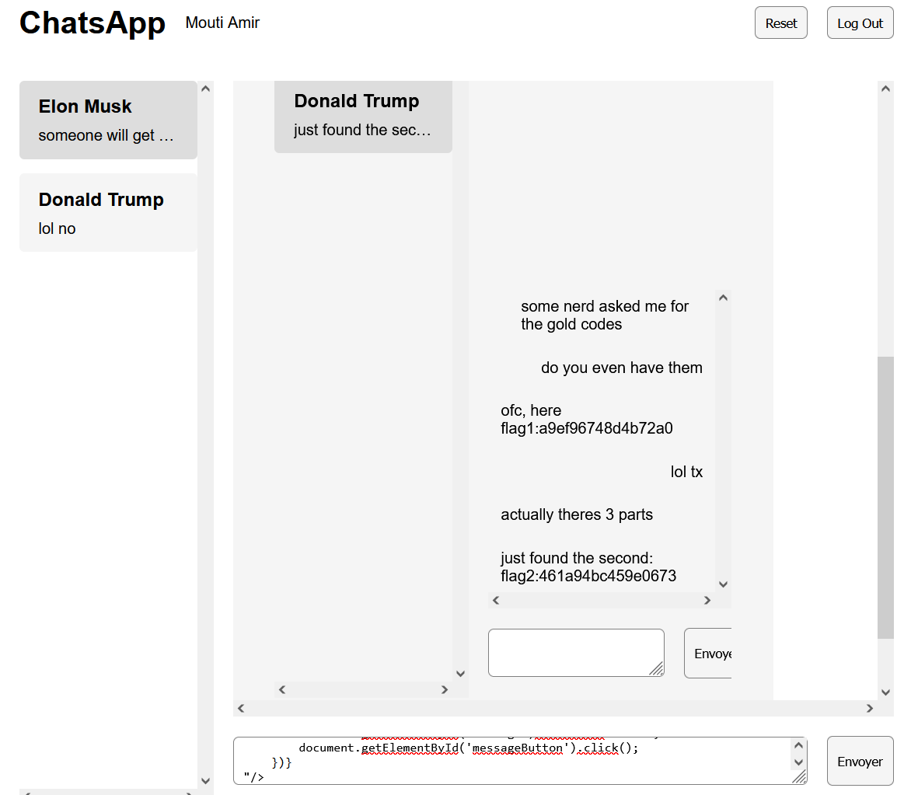
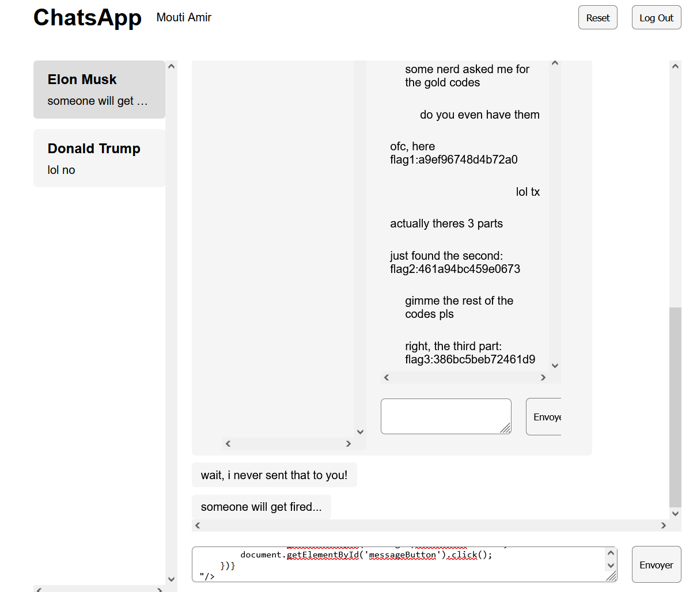
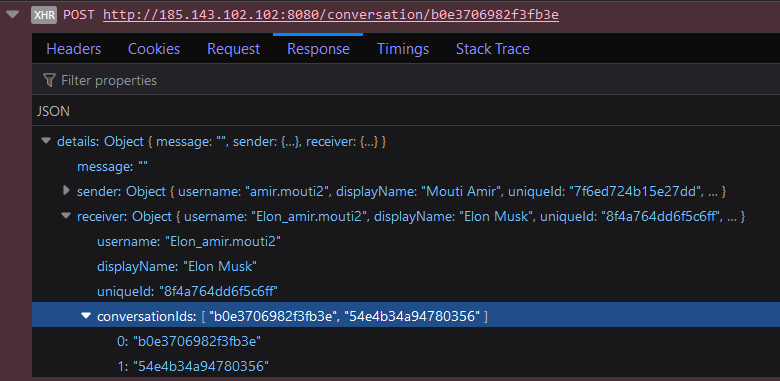
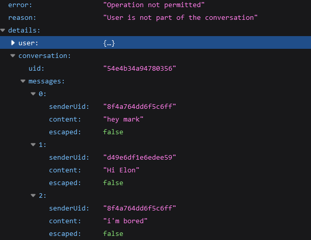

[](https://classroom.github.com/a/Nx5uMN_1)
# 7 Security

Énoncé [ici](https://web-classroom.github.io/labos/labo-7-security.html)

## Partie 1

Fait sur les profils amir.mouti1 et amir.mouti2

### Flag 1

**Flag**: flag1:a9ef96748d4b72a0

**Exploit**: 

On peut exécuter du code chez la cible en envoyant un message de cette forme

```

```

De cette manière on peut récupérer les conversationId de notre cible avec ce message:

```
 c.id).join('|||');
    console.log(t)
    document.getElementById('message').innerHTML = t;
    document.getElementById('messageButton').click()
}">
```

En l'envoyant à Elon Musk, on reçoit conversationc0827d0b544f6703|||conversationcfc613b4326619b8 comme réponse. c0827d0b544f6703 est l'ID de notre conversation avec Elon donc cfc613b4326619b8 est l'ID de la conversation entre Elon et Trump. Avec cet ID, on peut récupérer le contenu de l'URL /conversation/{conversationId} et nous l'envoyer par message:


```
 response.text())
    .then(data => {
        document.getElementById('message').innerHTML = data;
        document.getElementById('messageButton').click();
    })}
"/>
```
Avec ce message nous recevons toute la conversation entre Trump et Elon et les deux premiers flags d'un coup:


### Flag 2

**Flag**: flag2:461a94bc459e0673

**Exploit**: 

Le flag 2 a été aussi récupéré avec l'exploit du flag 1

### Flag 3

**Flag**: flag3:386bc5beb72461d9

**Exploit**: 

Toujours avec la même méthode pour exécuter du code chez une cible, on peut envoyer un message dans une conversation dont on connait l'ID. On a déjà récupéré l'ID de la conversation Elon/Trump au flag 1, on peut donc forcer Elon à envoyer un message avec:

```

```

Ensuite, on peut récupérer la conversation entre Elon et Trump de la même manière qu'au flag 1:

```
 response.text())
    .then(data => {
        document.getElementById('message').innerHTML = data;
        document.getElementById('messageButton').click();
    })}
"/>
```



## Partie 2

### Flag 4

**Flag**: flag4:b2d5951dfa86223c

**Exploit**: 

L'exploit ici est une injection de variable. On voit que le code qui est sensé détecter et déconnecter les utilisateurs inactifs ne déclare pas la variable nextTimeout. En changeant notre nom en "nextTimeout", la variable existe maintenant chez Elon et il se fait automatiquement déconnecter car la variable a une valeur qui est interprétée par le code comme un temps d'inactivité trop long.

### Flag 5

**Flag**: flag5:d0b0076bcc81f4ea

**Exploit**: 

En envoyant un message vide à Elon, on remarque que le message d'erreur nous donne trop d'information.



On y trouve notemment les conversationIds d'Elon. b0e3706982f3fb3e est l'ID de notre conversation, donc l'autre est celui de la conversation entre Elon et quelqu'un d'autre. En allant à l'URL /conversation/54e4b34a94780356 on reçoit un message d'erreur "Operation not permitted" mais aussi toute la conversation à laquelle on ne devrait pas avoir accès:



Plus bas dans la conversation, on retrouve bien le 5ème flag dans le message "might need a password flag5:d0b0076bcc81f4ea".

### Flag 6

Personnes inscrites à ChatsApp:
- `michelle.obama` oui
- `barack.obama` non
- `hillary.clinton` oui
- `george.w.bush` oui
- `jane.doe` non
- `sam.altman` oui
- `mira.murati` non
- `olivier.lemer` non

**Exploit**: 

Quand on essaie de se connecter, on remarque que si le username est faux ou si le mot de passe est vide, la réponse du site est presque instantanée alors que si le username existe et le mot de passe n'est pas vide, la réponse prend quelques secondes à arriver. On peut donc essayer tous les usernames fournits un à un et si on reçoit une erreur rapidement on sait que le compte n'existe pas.

## Exploit Supplémentaire

Lien vers ChatsApp qui, lorsque l'on clique dessus, exécute `alert(document.cookie)` dans le browser, que l'on soit actuellement connecté ou non à ChatsApp :

http://185.143.102.102:8080/login?error=%3Cscript%3Ealert(document.cookie);%3C/script%3E

## Correction des vulnérabilités
Si vous effectuez d'autres modifications que celles demandées, merci de les lister ici :

TODO